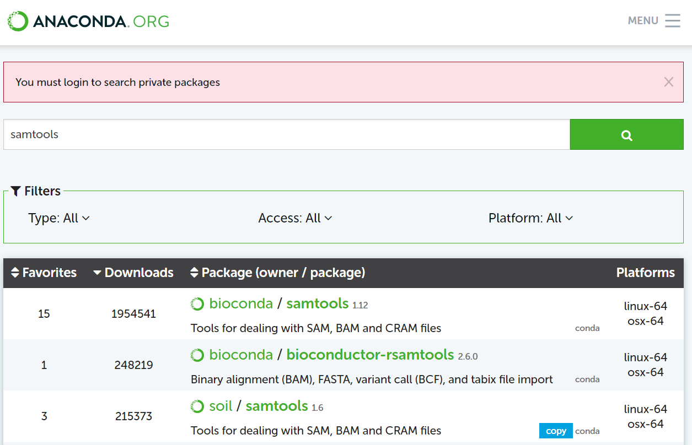
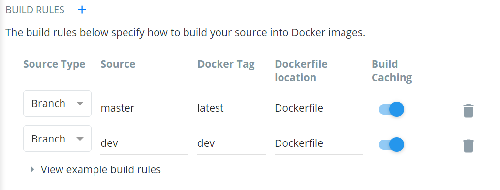
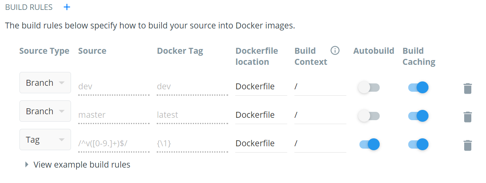

## Creating a workflow container

### 1. Create a workflow Github Repository
1. Create a GitHub repository following the instructions on GitHub.  
2. Create a new branch called 'dev'

    ```sh
    git checkout -b dev
    ```

### 2. The Conda Environment

* Prerequisite: [install conda](https://docs.conda.io/en/latest/miniconda.html)  
* See also: [conda cheatsheet](https://docs.conda.io/projects/conda/en/4.6.0/_downloads/52a95608c49671267e40c689e0bc00ca/conda-cheatsheet.pdf)

1. Search [Anaconda.org](https://anaconda.org/) for required packages. For this example we want 'samtools', 'bwa' and 'bcftools'. We can see these are all available from the 'bioconda'   channel.  
  

2. Create conda 'environment.yml' file in your workflow git repository. This specifies the channel name ('npwg-example'), the conda channels to use and required packages (dependencies). It is recommended to provided precise package versions, and to include 'conda-forge' in channels list. 

    ```YAML
    name: npwg-example
    channels:
      - conda-forge
      - bioconda
    dependencies:
      - bcftools=1.12
      - bwa=0.7.17
      - samtools=1.12
    ```

3. Create the conda environment using the environment file.

    ```sh
    conda env create -f environment.yml
    ```

4. Activate and test the new environment. This can now be used in a Nextflow workflow by setting `process.conda` to the environment prefix (you can find this by running `conda env list`).

    ```sh
    conda activate npwg-example
    **run tests**
    conda deactivate
    ```

5. If additional packages are required, you can add them environment.yml file and then update the conda environment as follows:

    ```sh
    conda env update -f environment.yml
    ```

### 3. The Docker Container

* Prerequisite: Github account and [Docker Hub](https://hub.docker.com/) account linked to GitHub Account

1. Create a file named 'Dockerfile' in your workflow git repository. The following is a generic dockerfile that can be used for any conda based container, the only parameter that needs to be set is `ARG NAME=` to that of your conda environment.

    ```dockerfile
    FROM biocontainers/biocontainers:latest
    
    LABEL \
      author="Jacob Munro" \
      description="Example container for NPWG" \
      maintainer="Bahlo Lab"
    
    # set the conda env name
    ARG NAME='npwg-example'
    
    # Install the conda environment
    COPY environment.yml /
    RUN conda env create -f /environment.yml && conda clean -a -y
    
    # set path
    ENV PATH="/opt/conda/envs/$NAME/bin:/opt/conda/bin:${PATH}"
    ```
2. Add 'Dockerfile' and 'environment.yml' to your git repository, commit changes and push to your github repository.

    ```sh
    git add Dockerfile environment.yml
    git commit -m 'add Dockerfile and environment.yml'
    git push origin dev
    ```
3. Navigate to [Docker Hub](https://hub.docker.com/), sign into your account and create a repository for your container.
    - Enter a name for your repository/container
    - Use the your GitHub account under Build Settings
    - Use the default build rule, as well as adding one for the dev branch


    - Click 'Create and Build' to create the container and start a build
    
4. Navigate to the 'Builds' tab in your container repository on Docker Hub. Here you can view the status of your build, and check the logs in case the build fails.
  - **Optional:** Turn off autobuild. By default Docker Hub will rebuild you container every time you push to your github repository. This mostly unnecessary, as you can trigger the builds manually whenever you make a change to 'Dockerfile' or 'environment.yml'. To do this navigate to the 'Builds' tab and then click 'Configure Automated Builds' and turn off 'Autobuild'.
  
5. Once you container has built successfully, you can start using it in your pipeline by using the container address (e.g. 'jemunro/npwg-example:dev').
      
### 4. Workflow & container versions

* The docker tags 'latest' and 'dev' will point to the most recent builds in your dev and master branches, however it is useful to tag specific container versions. This can be achieved using [git tags](https://git-scm.com/book/en/v2/Git-Basics-Tagging) and a Tag Autobuild rule on docker hub.

1. Add a 'Tag' rule to the Autobuild rule on Docker Hub (see below). This will pick up version tags such as 'v0.1' or 'v2.3.1'.




    
